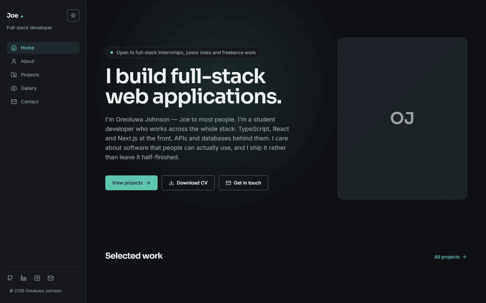

# Portfolio — Oreoluwa Johnson

My personal site: who I am, what I've built, and the photographs I take when
I'm not building it. Written from scratch in Next.js to replace a set of
hand-maintained HTML pages.



## What's in it

| Route | What it does |
| --- | --- |
| `/` | Hero, availability status and two featured projects |
| `/about` | Bio, skills grid, and a timeline of work, education and certifications |
| `/projects` | Every project, filterable by stack tag |
| `/projects/[slug]` | A case study each: the problem, what I built, what it taught me |
| `/gallery` | Photographs, filterable by category, in a keyboard-accessible lightbox |
| `/contact` | A validated contact form that emails me, plus the usual links |

Content lives in `src/data` and `src/lib/site.ts` rather than in the components,
so adding a project or changing the pitch is a data edit, not a layout one.

## Stack

- **Next.js 14** (App Router) and **React 18**
- **TypeScript**, strict
- **Tailwind CSS** — every colour comes from CSS variables in
  `src/app/globals.css`, so light and dark are one set of tokens
- **Zod** for contact-form validation, shared between the browser and the
  server action
- **Resend** for delivery
- **@vercel/og** for the social cards and icons, generated at build time
- **sharp** for the image-optimisation script

No component library: the UI is written here.

## Running it locally

Node 18.17 or newer.

```bash
git clone https://github.com/Just-joe924/Portfolio.git
cd Portfolio
npm install
cp .env.example .env.local   # then fill it in — see below
npm run dev                  # http://localhost:3000
```

The site runs without any environment variables. Only the contact form needs
them: without a `RESEND_API_KEY` it validates input and then reports that it
couldn't send, which is the intended behaviour rather than a crash.

| Variable | Needed for | Notes |
| --- | --- | --- |
| `RESEND_API_KEY` | Sending contact-form mail | A "Sending access" key from [resend.com/api-keys](https://resend.com/api-keys) |
| `CONTACT_TO_EMAIL` | Sending contact-form mail | Where messages are delivered |
| `CONTACT_FROM_EMAIL` | Sending contact-form mail | Resend's test sender only delivers to your own account address until you verify a domain |
| `NEXT_PUBLIC_SITE_URL` | Correct canonical URLs | Set it per deployment; falls back to the production domain |

### Scripts

| Command | Does |
| --- | --- |
| `npm run dev` | Development server |
| `npm run build` | Production build — also generates the sitemap, robots, icons and social cards |
| `npm run start` | Serve a production build |
| `npm run lint` | ESLint |
| `npm run images` | Re-compress and resize the photographs in `public/images` |

## Adding things

**A project** — add an entry to `src/data/projects.ts` and drop a cover at
`public/images/projects/<slug>.png`. The card, the case-study page, its social
card and the sitemap entry all follow from that. A missing cover falls back to a
generated placeholder rather than a broken image.

**A photograph** — run `npm run images` to compress it, then add it to
`src/data/gallery.ts` with a title, caption and category.

**Your face** — put a portrait at `public/images/portrait.jpg`. The hero swaps
from the monogram placeholder to the photo on its own, and the same image is
inlined into the social card. Nothing to wire up: `src/lib/assets.ts` checks
whether the file exists at build time.

**A CV** — put a PDF at `public/oreoluwa-johnson-cv.pdf` and the download button
appears. Same check.

## Deploying

Hosted on Vercel, built on every push. `main` is production; every pull request
gets its own preview URL.

The three `CONTACT_*` variables and `RESEND_API_KEY` are set as production
environment variables in the Vercel dashboard — they are not in the repo, and
`.env.local` is git-ignored.

## Notes

- The social card at `/opengraph-image` and the icons at `/icon` and
  `/apple-icon` are drawn in code (`src/lib/og.tsx`) and rendered to PNG at
  build time, so they stay in step with the palette in `src/lib/brand.ts`.
- `@vercel/og` is a direct dependency rather than `next/og`: the copy bundled
  with Next 14.2 builds a font path that is invalid on Windows. See the comment
  at the top of `src/lib/og.tsx`.
- The previous hand-written HTML version of this site is in the git history, up
  to the commit that removed `legacy/`.
